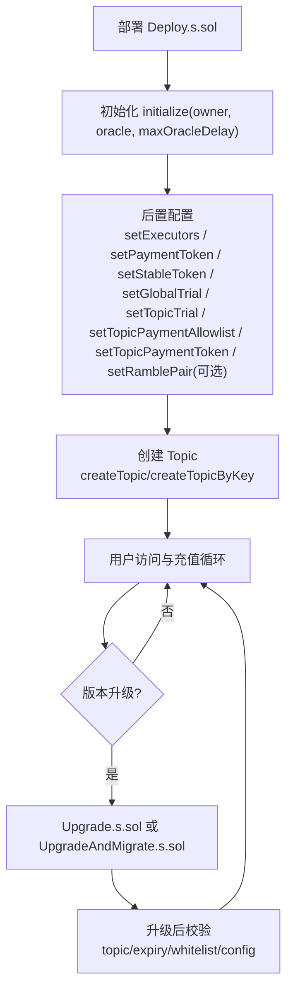
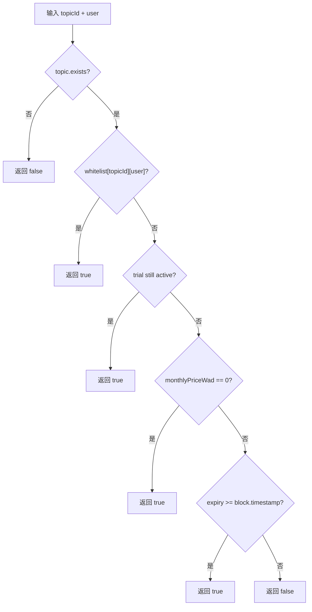
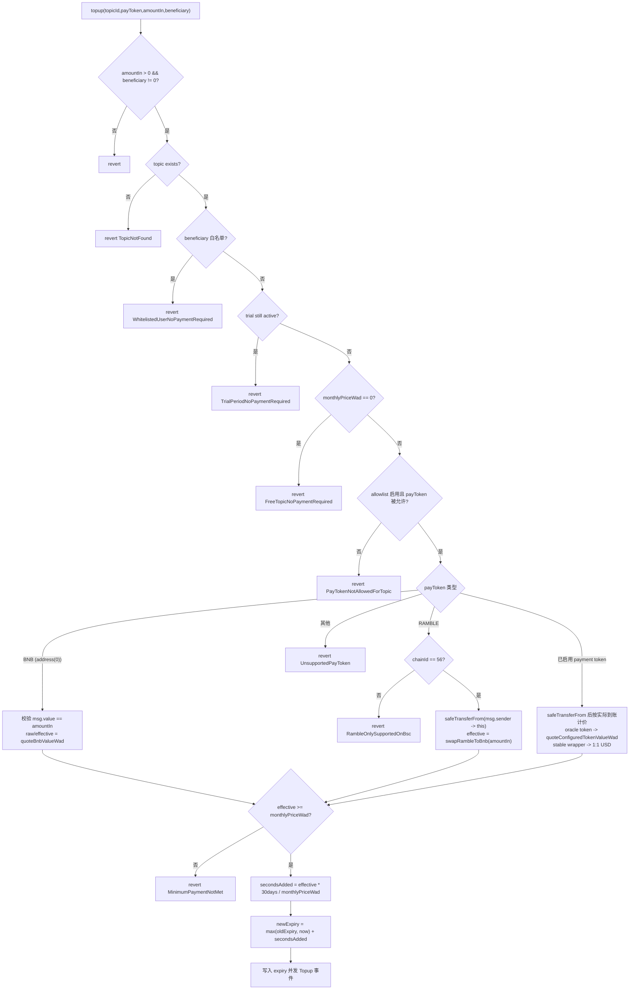
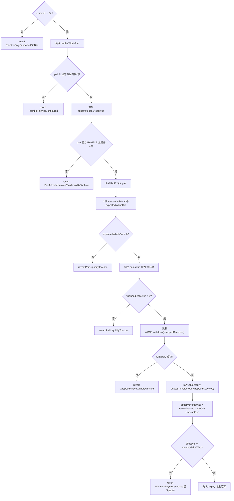
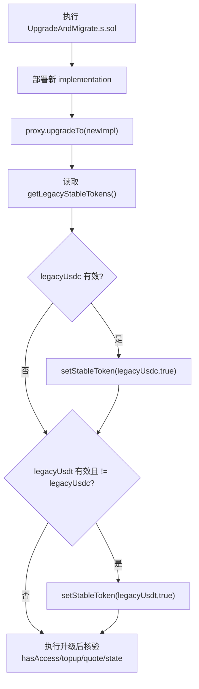
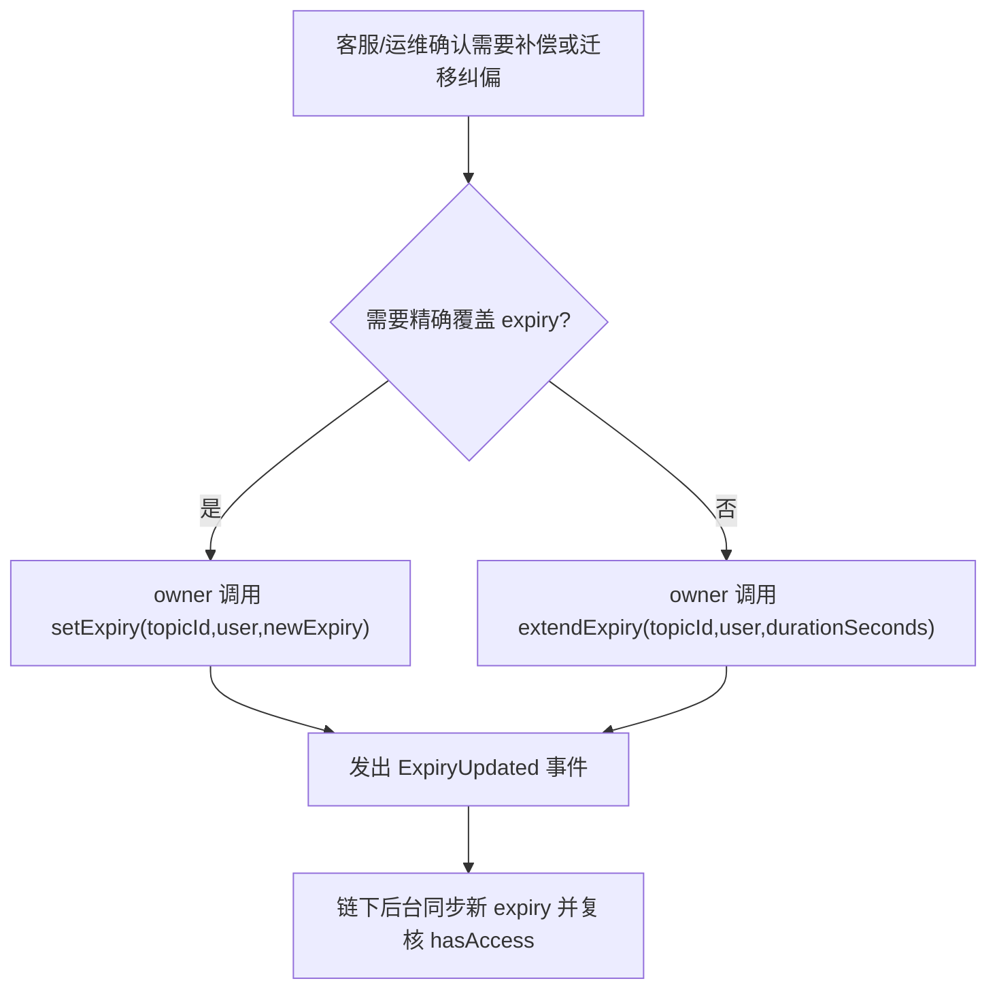
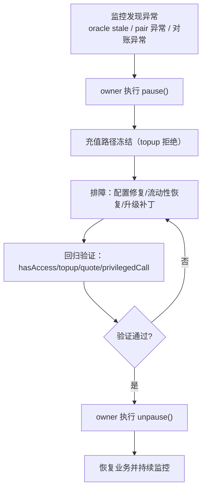

# BSC Topic 权限合约流程图（v1.0）

关联文档：`../requirements/product-requirements.md`、`./architecture.md`、`../operations/runbook.md`

## 1. 系统生命周期总流程

## 2. 鉴权 `hasAccess` 详细流程

## 3. 充值 `topup` 主流程

## 4. RAMBLE 真实兑换路径（交易内结算）

## 5. 升级与迁移流程（旧版推荐）

## 6. 人工订阅期纠偏流程

## 7. 运维应急流程（暂停与恢复）

## 8. 使用说明
- 以上流程图与 `../operations/runbook.md` 的 runbook 一一对应。
- 如果图与实现不一致，以合约行为与测试结果为准，并回改本文档。
