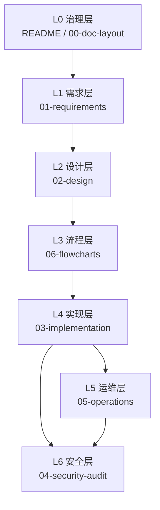

# auth-contract 文档 Layout 记录（v1.0）

关联文档：`./README.md`、`./06-flowcharts.md`

## 1. 目标
- 固化文档分层，避免需求、设计、实现、运维信息混写。
- 明确每份文档的职责边界与更新触发条件。
- 让评审时可以快速判断“应该改哪份文档”。

## 2. 文档分层与职责
| 层级 | 文档 | 职责 | 必填内容 |
| --- | --- | --- | --- |
| L0 | `README.md` | 导航索引 | 阅读顺序、关系图、全局术语 |
| L0 | `00-doc-layout.md` | 文档治理 | 分层定义、更新流程、检查清单 |
| L1 | `01-requirements.md` | 业务需求基线 | `FR/NFR/AT`、接口清单、边界规则 |
| L2 | `02-design.md` | 架构设计 | 模块拆分、状态布局、升级策略 |
| L3 | `06-flowcharts.md` | 执行流程视图 | 关键路径流程图、决策分支 |
| L4 | `03-implementation.md` | 实现落地 | 代码结构、测试映射、命令 |
| L5 | `05-operations.md` | 运维执行 | 部署/升级/迁移/回滚 runbook |
| L6 | `04-security-audit.md` | 安全闭环 | 发现、修复、残余风险、建议 |

## 3. 文档依赖关系

## 4. 变更触发规则
- 需求变更（新增功能、边界变化、计费规则变化）：
  - 必改：`01-requirements.md`、`06-flowcharts.md`
  - 联动：`02-design.md`、`03-implementation.md`
- 合约接口或存储布局变化：
  - 必改：`02-design.md`、`03-implementation.md`
  - 联动：`05-operations.md`（升级步骤）、`04-security-audit.md`
- 运维流程变化（部署脚本、升级脚本、应急机制）：
  - 必改：`05-operations.md`
  - 联动：`06-flowcharts.md`
- 安全修复或审计新发现：
  - 必改：`04-security-audit.md`
  - 联动：`03-implementation.md`、`05-operations.md`

## 5. 更新流程（Doc-First）
1. 先改 `01-requirements.md`（如果业务语义变化）。
2. 再改 `02-design.md`（映射到架构与状态模型）。
3. 同步 `06-flowcharts.md`（落流程，不留抽象描述）。
4. 最后改 `03-implementation.md`、`05-operations.md`、`04-security-audit.md`。
5. 回到 `README.md` 检查导航是否仍完整。

## 6. 一致性检查清单
- 是否仍统一使用 `WAD(1e18)` 与 `...Wad` 命名。
- 是否仍明确 `topicId = keccak256(bytes(topicKey))`。
- `hasAccess` 优先级与 `topup` 边界是否前后文一致。
- 是否明确免费 Topic（`monthlyPriceWad=0`）行为：有权限但不可充值。
- 升级与迁移步骤是否与脚本名称一致（`Upgrade.s.sol` / `UpgradeAndMigrate.s.sol`）。
- 运维与安全文档中的风险描述是否引用同一事实与同一接口。

## 7. 版本记录策略
- 文档版本号使用 `vX.Y`，在标题维护。
- 每次结构性改动（新增层级/新增文档）至少提升 `Y`。
- 若流程路径发生变化（如充值路径、升级流程变化），必须更新 `06-flowcharts.md`。
